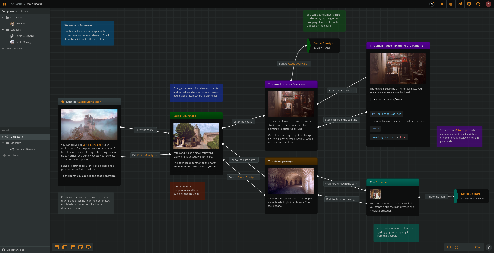
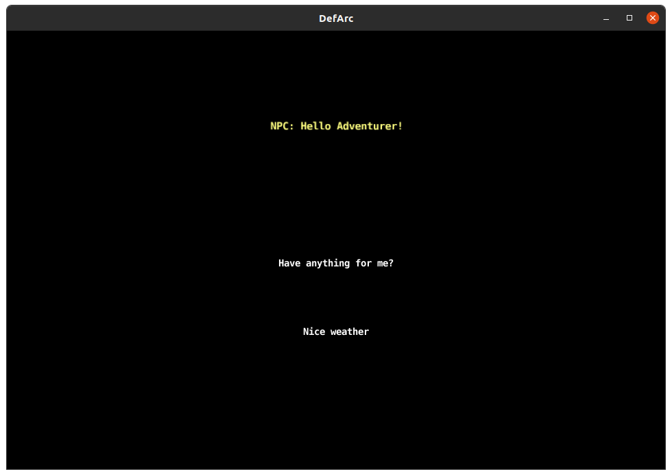

# DefArc - Defold module for Arcweave

DefArc is a runtime for Arcweave projects, a module helping easily create interactive branching or linear conversations or quests flow - anything you can create in [Arcweave](https://arcweave.com) for [Defold game engine](https://defold.com).

DefArc is a JSON parser and a set of helper functions to easily and conveniently create a dialogue flow in Lua. It comes with unit tests and an example Defold project. You can mix DefArc with other Defold assets like [RichText](https://defold.com/assets/richtext/) or [Defold Printer](https://defold.com/assets/printer/) for text animation and displaying and [Gooey](https://defold.com/assets/gooey/) or [Druid](https://defold.com/assets/druid/) for GUI handling.

DefArc is an incarnation or inheritance of my first narrative module - [Defork](https://github.com/paweljarosz/defork) that was used with JSON files produced by Twinson format for open-source [Twine](https://twinery.org). Arcweave is not open-source, but its free plan allows you to create anything in a much more enhanced, advanced and professional environment with possibility to collaborate online on one project (2 editors for free plan). Arcweave offers also paid plans with larger limits like more editors for online collaboration on projects for larger teams. For solodevs or indie teams, it's a great [tool used by professionals](https://arcweave.com/customers) like CDPR, Mojang, Microsoft, Primal, etc.


Logo made with [DesignEvo](https://designevo.com)

## Installation

In order to use DefArc in your Defold game add it to your [game.project](defold://open?path=/game.project) as a [Defold library dependency](https://defold.com/manuals/libraries/).

Once added, you must require the main Lua module in scripts via

```
local defarc = require("defarc.defarc")
```

Then you need to add dialogs exported from Arcweave in a [JSON format](https://arcweave.com/docs/1.0/export) to your project. To add it, you need to provide a path in **Custom Resource** field of your *game.project* in Defold. For example, if you have your file in the assets folder in the project directory, type: assets or specifically: assets/dialogue.json. You can find more informations about custom resources in official Defold's [documentation here](https://defold.com/manuals/resource/).

## What you can do?

With DefArc you can easily:

- add linear or non-linear, interactive dialogues to your games
- utilize powerful Arcweave branching with code chunks
- load and save variables changing the flow of conversations
- load json data exported from Arcweave conversation making tool
- get text, options and links leading to next conversation's nodes
- store and manage current links, options and flow through nodes
- modify data by adding actors, colors and custom text effects
- add images, portraits, locations or emoticons from Arcweave assets

## Arcweave

Arcweave allows to create complex diagrams that can be used to build linear dialogues, non-linear branching conversations with variables or quest or story flow design.
Arcweave offers a lot of options, all of them are available in free plan. Check out Arcweave features [here](https://arcweave.com).




## Defold Example

Though DefArc offers over hundred of functions, for most games purposes, one would practically narrow the usage to just few. A simple example for handling branching dialogue in Defold is used in example project. For it to work you need to:

1) Load the project from JSON resource:

```
defarc.load("/dialogs/test_board.json") -- loading Arcweave exported JSON from custom resources
```

2) Select an element to start working with it, e.g. displaying the text and options.

```
defarc.select_element("Example welcome") -- selecting element by its title from Arcweave element
```

4) Get text and options_table and put it in GUI:

```
local text = defarc.get_text()
	local options = defarc.get_options_table()

	gui.set_text(gui.get_node("NPC"), text) -- set text

	for i=1,3 do                            -- set 3 corresponding options
		gui.set_text(gui.get_node("Option_"..i), options[i] and options[i].label or "")
	end
```

The given example runs a simple conversation, where you can choose each of the options and when reaching an end - it starts again.



## Tests

To check if DefArc is working you can run a set of unit and functional tests from the example:

```
local defarc_test = require "defarc.defarc_test"
defarc_test.run()
```

Happy DefArcing!

___

# DefArc API

## Project

### .load(resource)
	Loads a Custom Resource with a JSON dialogue data. This function saves this data inside DefArc module for convenience and optimization, so there is no need to provide dialogue (aka conversation) data for every function, that takes it as a parameter. This makes this function to be called first a necessity.
	One must provide a proper JSON format data to assure DefArc will parse it correctly.

* **PARAMETER:**  `resource` (string) - an address of a custom resource containing JSON format dialogue data.
* **RETURNS:** `dialogue_data` (table) - a loaded table with dialogue data.

```
	local dialogue_data = defarc.load("/assets/dialogue.json")
```

### .create(resource)
	Loads a Custom Resource with a JSON dialogue data. This function creates and returns an instance of DefArc for a OOP approach.
	One must provide a proper JSON format data to assure DefArc will parse it correctly.

* **PARAMETER:** `resource` (string) - an address of a custom resource containing JSON format dialogue data.
* **RETURNS:** `defarc_instance` (metatable) - a created instance with dialogue data and all the functions.

```
	local defarc_instance = defarc.create("/assets/dialogue.json")
```

### .get_project_name()
	Returns the Project Name of the loaded data.

* **RETURNS:** `project_name` (string) - a project name

```
	local project_name = defarc.get_project_name()
```

### .get_project_cover()
	Returns an asset_id to an asset set as a Project Cover. One can then use this id to obtain all data about an asset.

* **RETURNS:** `cover_asset_id` (asset_id) - a project name

```
	local cover_asset_id = defarc.get_project_cover()
```

## Boards

### .get_boards()
	Returns all boards of the loaded project.

* **RETURNS:** `boards_table` (table) - a table with all the boards in the project, where key is a board_id and value is a table with board contents

```
	local project_boards = defarc.get_boards()
```

### .get_boards_names()
	Returns a table with ids and names of the boards of the loaded project.

* **RETURNS:** `boards_names_table` (table) - a table with all the boards in the project, where key is a board_id and value is a board name

```
	local project_boards_names = defarc.get_boards_names()
```

### .get_board_by_id(board_id)
	Returns a table with selected board data. One need to provide a proper board id, otherwise it will return nil.

* **PARAMETER:** `board_id` (string) - an id of a board from Arcweave JSON
* **RETURNS:** `board_table` (table) - a table with data regarding selected board

```
	local board_table = defarc.get_board_by_id("proper-id")
```

### .get_board_by_name(board_name)
	Returns a table with selected board data. One need to provide a proper board name, otherwise it will return nil.

* **PARAMETER:** `board_name` (string) - a name of a board from Arcweave JSON
* **RETURNS:** `board_table` (table) - a table with data regarding selected board

```
	local board_table = defarc.get_board_by_name("proper-name")
```

### .get_board([board])
	Returns a table with selected board data. This function returns a proper board if proper board_id or board_name is provided, otherwise it returns a saved/selected board_table.

* **PARAMETER:** `board` (string, optional) - an id or name of a board from Arcweave JSON or Lua table with board data (board_table)
* **RETURNS:** `board_table` (table) - a table with data regarding selected board

```
	local board_table = defarc.get_board() -- will return a saved board, if there is any saved (selected by below functions)
```

### .select_board_by_id(board_id)
	Selects and saves a table with board data inside DefArc module. One need to provide a proper board id, otherwise it will save nil.

* **PARAMETER:** `board_id` (string) - an id of a board from Arcweave JSON

```
	defarc.select_board_by_id("proper-id") -- will select and save inside DefArc module a board data for given id
```

### .select_board_by_name(board_name)
	Selects and saves a table with board data inside DefArc module. One need to provide a proper board name, otherwise it will save nil.

* **PARAMETER:** `board_name` (string) - a name of a board from Arcweave JSON

```
	defarc.select_board_by_name("proper-name") -- will select and save inside DefArc module a board data for given name
```

### .select_board(board)
	Selects and saves a table with board data inside DefArc module. One need to provide a proper board name or board id or board Lua table, otherwise it will save nil.

* **PARAMETER:** `board` (string) - an id or name of a board from Arcweave JSON or Lua table with board data (board_table)

```
	defarc.select_board("proper-name") -- will select and save inside DefArc module a board data for given name
```

## Board Content

### .get_board_name([board])
	Returns a board name of selected board data. This function returns a proper board name if proper board_id or board_name is provided, otherwise it returns a board name of saved/selected board_table.

* **PARAMETER:** `board` (string, optional) - an id or name of a board from Arcweave JSON or Lua table with board data (board_table)
* **RETURNS:** `board_table` (table) - a table with data regarding selected board

```
	local board_name = defarc.get_board_name()
```

### .get_notes([board])
	Returns a table with notes data of selected board data. This function returns a proper notes table if proper board_id or board_name is provided, otherwise it returns a notes table of saved/selected board_table.

* **PARAMETER:** `board` (string, optional) - an id or name of a board from Arcweave JSON or Lua table with board data (board_table)
* **RETURNS:** `notes_table` (table) - a table with data regarding selected board notes - for each key (which is *note_id)*, value is a table with note data (with fields: *theme* (color of the note in Arcweave) and *content*)

```
	local note_content = defarc.get_notes()["some-note-id"].content
```

### .get_board_jumpers([board])
	Returns a table with jumpers data of selected board data. This function returns a proper jumpers table if proper board_id or board_name is provided, otherwise it returns a jumpers table of saved/selected board_table.

* **PARAMETER:** `board` (string, optional) - an id or name of a board from Arcweave JSON or Lua table with board data (board_table)
* **RETURNS:** `jumpers_table` (table) - a table with data regarding selected board jumpers - for each key (which is *jumper_id*), value is an *element_id* to which the jumper links

```
	local jump_to = defarc.get_board_jumpers()["some-jumper-id"]
```

### .get_board_branches([board])
	Returns a table with branches data of selected board data. This function returns a proper branches table if proper board_id or board_name is provided, otherwise it returns a branches table of saved/selected board_table.

* **PARAMETER:** `board` (string, optional) - an id or name of a board from Arcweave JSON or Lua table with board data (board_table)
* **RETURNS:** `branches_table` (table) - a table with data regarding selected board branches - for each key (which is *branch_id*), value is a table with branch data

```
	local board_branches = defarc.get_board_branches()
```

### .get_board_elements([board])
	Returns a table with elements data of selected board data. This function returns a proper elements table if proper board_id or board_name is provided, otherwise it returns an elements table of saved/selected board_table.

* **PARAMETER:** `board` (string, optional) - an id or name of a board from Arcweave JSON or Lua table with board data (board_table)
* **RETURNS:** `elements_table` (table) - a table with data regarding selected board elements - for each key (which is *element_id*), value is a table with element data

```
	local board_elements = defarc.get_board_elements()
```

### .get_board_connections([board])
	Returns a table with connections data of selected board data. This function returns a proper connections table if proper board_id or board_name is provided, otherwise it returns a connections table of saved/selected board_table.

* **PARAMETER:** `board` (string, optional) - an id or name of a board from Arcweave JSON or Lua table with board data (board_table)
* **RETURNS:** `connections_table` (table) - a table with data regarding selected board connections - for each key (which is *connection_id*), value is a table with connection data

```
	local board_connections = defarc.get_board_connections()
```

## Components

### .get_components()
	Returns a table with all components of the project.

* **RETURNS:** `components_table` (table) - a table with data regarding components of the project

```
	local components = defarc.get_components()
```

### .get_components_names()
	Returns a table with all components names of the project.

* **RETURNS:** `components_names_table` (table) - a table where for each key (which is a *component_id*), value is a component name

```
	local components_names = defarc.get_components_names()
```

### .get_component_by_id(component_id)
	Returns a table with selected component data. One need to provide a proper component id, otherwise it will return nil.

* **PARAMETER:** `component_id` (string) - an id of a component from Arcweave JSON
* **RETURNS:** `component_table` (table) - a table with data regarding selected component

```
	local component_table = defarc.get_component_by_id("proper-id")
```

### .get_component_by_name(component_name)
	Returns a table with selected component data. One need to provide a proper component name, otherwise it will return nil.

* **PARAMETER:** `component_name` (string) - a name of a component from Arcweave JSON
* **RETURNS:** `component_table` (table) - a table with data regarding selected component

```
	local component_table = defarc.get_component_by_name("proper-name")
```

### .get_component([component])
	Returns a table with selected component data. This function returns a proper component if proper component_id or component_name is provided, otherwise it returns a saved/selected component_table.

* **PARAMETER:** `component` (string, optional) - an id or name of a component from Arcweave JSON or Lua table with component data (component_table)
* **RETURNS:** `component_table` (table) - a table with data regarding selected component

```
	local component_table = defarc.get_component() -- will return a saved component, if there is any saved (selected by below functions)
```

### .select_component_by_id(component_id)
	Selects and saves a table with component data inside DefArc module. One need to provide a proper component id, otherwise it will save nil.

* **PARAMETER:** `component_id` (string) - an id of a component from Arcweave JSON

```
	defarc.select_component_by_id("proper-id") -- will select and save inside DefArc module a component data for given id
```

### .select_component_by_name(component_name)
	Selects and saves a table with component data inside DefArc module. One need to provide a proper component name, otherwise it will save nil.

* **PARAMETER:** `component_name` (string) - a name of a component from Arcweave JSON

```
	defarc.select_component_by_name("proper-name") -- will select and save inside DefArc module a component data for given name
```

### .select_component(component)
	Selects and saves a table with component data inside DefArc module. One need to provide a proper component name or component id or component Lua table, otherwise it will save nil.

* **PARAMETER:** `component` (string) - an id or name of a component from Arcweave JSON or Lua table with component data (component_table)

```
	defarc.select_component("proper-name") -- will select and save inside DefArc module a component data for given name
```

## Component Content

### .get_component_name([component])
	Returns a component name of selected component data. This function returns a proper component name if proper component_id or component_name is provided, otherwise it returns a component name of saved/selected component_table.

* **PARAMETER:** `component` (string, optional) - an id or name of a component from Arcweave JSON or Lua table with component data (component_table)
* **RETURNS:** `component_name` (string) - a string with component name

```
	local component_name = defarc.get_component_name()
```

### .get_component_attributes([component])
	Returns a table with attributes data of selected component data. This function returns a proper attributes table if proper component_id or component_name is provided, otherwise it returns a attributes table of saved/selected component_table.

* **PARAMETER:** `component` (string, optional) - an id or name of a component from Arcweave JSON or Lua table with component data (component_table)
* **RETURNS:** `attributes_table` (table) - a table with data regarding selected component attributes - for each key (which is *attribute_id*), value is an *element_id* to which the attribute links

```
	local jump_to = defarc.get_component_attributes()["some-attribute-id"]
```

### .get_component_assets([component])
	Returns a table with assets data of selected component data. This function returns a proper assets table if proper component_id or component_name is provided, otherwise it returns a assets table of saved/selected component_table.

* **PARAMETER:** `component` (string, optional) - an id or name of a component from Arcweave JSON or Lua table with component data (component_table)
* **RETURNS:** `assets_table` (table) - a table with data regarding selected component assets - for each key (which is *asset_id*), value is an *element_id* to which the asset links

```
	local jump_to = defarc.get_component_assets()["some-asset-id"]
```

## Attributes

### .get_attributes()
	Returns a table with all attributes of the project.

* **RETURNS:** `attributes_table` (table) - a table with data regarding attributes of the project

```
	local attributes = defarc.get_attributes()
```

### .get_attributes_names()
	Returns a table with all attributes names of the project.

* **RETURNS:** `attributes_names_table` (table) - a table where for each key (which is a *attribute_id*), value is a attribute name

```
	local attributes_names = defarc.get_attributes_names()
```

### .get_attribute_by_id(attribute_id)
	Returns a table with selected attribute data. One need to provide a proper attribute id, otherwise it will return nil.

* **PARAMETER:** `attribute_id` (string) - an id of a attribute from Arcweave JSON
* **RETURNS:** `attribute_table` (table) - a table with data regarding selected attribute

```
	local attribute_table = defarc.get_attribute_by_id("proper-id")
```

### .get_attribute_by_name(attribute_name)
	Returns a table with selected attribute data. One need to provide a proper attribute name, otherwise it will return nil.

* **PARAMETER:** `attribute_name` (string) - a name of a attribute from Arcweave JSON
* **RETURNS:** `attribute_table` (table) - a table with data regarding selected attribute

```
	local attribute_table = defarc.get_attribute_by_name("proper-name")
```

### .get_attribute([attribute])
	Returns a table with selected attribute data. This function returns a proper attribute if proper attribute_id or attribute_name is provided, otherwise it returns a saved/selected attribute_table.

* **PARAMETER:** `attribute` (string, optional) - an id or name of a attribute from Arcweave JSON or Lua table with attribute data (attribute_table)
* **RETURNS:** `attribute_table` (table) - a table with data regarding selected attribute

```
	local attribute_table = defarc.get_attribute() -- will return a saved attribute, if there is any saved (selected by below functions)
```

### .select_attribute_by_id(attribute_id)
	Selects and saves a table with attribute data inside DefArc module. One need to provide a proper attribute id, otherwise it will save nil.

* **PARAMETER:** `attribute_id` (string) - an id of a attribute from Arcweave JSON

```
	defarc.select_attribute_by_id("proper-id") -- will select and save inside DefArc module a attribute data for given id
```

### .select_attribute_by_name(attribute_name)
	Selects and saves a table with attribute data inside DefArc module. One need to provide a proper attribute name, otherwise it will save nil.

* **PARAMETER:** `attribute_name` (string) - a name of a attribute from Arcweave JSON

```
	defarc.select_attribute_by_name("proper-name") -- will select and save inside DefArc module a attribute data for given name
```

### .select_attribute(attribute)
	Selects and saves a table with attribute data inside DefArc module. One need to provide a proper attribute name or attribute id or attribute Lua table, otherwise it will save nil.

* **PARAMETER:** `attribute` (string) - an id or name of a attribute from Arcweave JSON or Lua table with attribute data (attribute_table)

```
	defarc.select_attribute("proper-name") -- will select and save inside DefArc module a attribute data for given name
```

## Attribute Content

### .get_attribute_name([attribute])
	Returns a attribute name of selected attribute data. This function returns a proper attribute name if proper attribute_id or attribute_name is provided, otherwise it returns a attribute name of saved/selected attribute_table.

* **PARAMETER:** `attribute` (string, optional) - an id or name of a attribute from Arcweave JSON or Lua table with attribute data (attribute_table)
* **RETURNS:** `attribute_name` (string) - a string with attribute name

```
	local attribute_name = defarc.get_attribute_name()
```

### .get_attribute_value([attribute])
	Returns a attribute value table of selected attribute data. This function returns a proper attribute name if proper attribute_id or attribute_name is provided, otherwise it returns a attribute value of saved/selected attribute_table.

* **PARAMETER:** `attribute` (string, optional) - an id or name of a attribute from Arcweave JSON or Lua table with attribute data (attribute_table)
* **RETURNS:** `attribute_value` (table) - a table with fileds *data* and *type*

```
	local attribute_value = defarc.get_attribute_value()
```

### .get_attribute_data([attribute])
	Returns a attribute value data of selected attribute data. This function returns a proper attribute name if proper attribute_id or attribute_name is provided, otherwise it returns a attribute value data of saved/selected attribute_table.

* **PARAMETER:** `attribute` (string, optional) - an id or name of a attribute from Arcweave JSON or Lua table with attribute data (attribute_table)
* **RETURNS:** `attribute_data` (string or table) - a string with attribute value data or a table with components list

```
	local attribute_value_data = defarc.get_attribute_data()
```

### .get_attribute_type([attribute])
	Returns a attribute value type of selected attribute data. This function returns a proper attribute name if proper attribute_id or attribute_name is provided, otherwise it returns a attribute value type of saved/selected attribute_table.

* **PARAMETER:** `attribute` (string, optional) - an id or name of a attribute from Arcweave JSON or Lua table with attribute data (attribute_table)
* **RETURNS:** `attribute_type` (string) - a string with attribute value type, e.g. "string", "integer", "component-list"

```
	local attribute_value_type = defarc.get_attribute_type()
```

## Assets

### .get_assets()
	Returns a table with all assets of the project.

* **RETURNS:** `assets_table` (table) - a table with data regarding assets of the project

```
	local assets = defarc.get_assets()
```

### .get_assets_names()
	Returns a table with all assets names of the project.

* **RETURNS:** `assets_names_table` (table) - a table where for each key (which is a *asset_id*), value is a asset name

```
	local assets_names = defarc.get_assets_names()
```

### .get_asset_by_id(asset_id)
	Returns a table with selected asset data. One need to provide a proper asset id, otherwise it will return nil.

* **PARAMETER:** `asset_id` (string) - an id of a asset from Arcweave JSON
* **RETURNS:** `asset_table` (table) - a table with data regarding selected asset

```
	local asset_table = defarc.get_asset_by_id("proper-id")
```

### .get_asset_by_name(asset_name)
	Returns a table with selected asset data. One need to provide a proper asset name, otherwise it will return nil.

* **PARAMETER:** `asset_name` (string) - a name of a asset from Arcweave JSON
* **RETURNS:** `asset_table` (table) - a table with data regarding selected asset

```
	local asset_table = defarc.get_asset_by_name("proper-name")
```

### .get_asset([asset])
	Returns a table with selected asset data. This function returns a proper asset if proper asset_id or asset_name is provided, otherwise it returns a saved/selected asset_table.

* **PARAMETER:** `asset` (string, optional) - an id or name of a asset from Arcweave JSON or Lua table with asset data (asset_table)
* **RETURNS:** `asset_table` (table) - a table with data regarding selected asset

```
	local asset_table = defarc.get_asset() -- will return a saved asset, if there is any saved (selected by below functions)
```

### .select_asset_by_id(asset_id)
	Selects and saves a table with asset data inside DefArc module. One need to provide a proper asset id, otherwise it will save nil.

* **PARAMETER:** `asset_id` (string) - an id of a asset from Arcweave JSON

```
	defarc.select_asset_by_id("proper-id") -- will select and save inside DefArc module a asset data for given id
```

### .select_asset_by_name(asset_name)
	Selects and saves a table with asset data inside DefArc module. One need to provide a proper asset name, otherwise it will save nil.

* **PARAMETER:** `asset_name` (string) - a name of a asset from Arcweave JSON

```
	defarc.select_asset_by_name("proper-name") -- will select and save inside DefArc module a asset data for given name
```

### .select_asset(asset)
	Selects and saves a table with asset data inside DefArc module. One need to provide a proper asset name or asset id or asset Lua table, otherwise it will save nil.

* **PARAMETER:** `asset` (string) - an id or name of a asset from Arcweave JSON or Lua table with asset data (asset_table)

```
	defarc.select_asset("proper-name") -- will select and save inside DefArc module a asset data for given name
```

## Asset Content

### .get_asset_name([asset])
	Returns a asset name of selected asset data. This function returns a proper asset name if proper asset_id or asset_name is provided, otherwise it returns a asset name of saved/selected asset_table.

* **PARAMETER:** `asset` (string, optional) - an id or name of a asset from Arcweave JSON or Lua table with asset data (asset_table)
* **RETURNS:** `asset_name` (string) - a string with asset name

```
	local asset_name = defarc.get_asset_name()
```

### .get_asset_type([asset])
	Returns a asset type of selected asset data. This function returns a proper asset name if proper asset_id or asset_name is provided, otherwise it returns a asset type of saved/selected asset_table.

* **PARAMETER:** `asset` (string, optional) - an id or name of a asset from Arcweave JSON or Lua table with asset data (asset_table)
* **RETURNS:** `asset_type` (string) - a string with asset type e.g. "image"

```
	local asset_type = defarc.get_asset_type()
```

### .get_asset_children([asset])
	Returns a table with asset children of selected asset data. This function returns a proper asset name if proper asset_id or asset_name is provided, otherwise it returns a children table of saved/selected asset_table.

* **PARAMETER:** `asset` (string, optional) - an id or name of a asset from Arcweave JSON or Lua table with asset data (asset_table)
* **RETURNS:** `asset_children` (table) - a table with asset children, where each entry is another asset id 

```
	local asset_child_id = defarc.get_asset_children()["some-proper-asset-id"]
```

## Global Variables

### .get_variables()
	Returns a table with all variables of the project.

* **RETURNS:** `variables_table` (table) - a table with data regarding variables of the project

```
	local variables = defarc.get_variables()
```

### .get_variables_names()
	Returns a table with all variables names of the project.

* **RETURNS:** `variables_names_table` (table) - a table where for each key (which is a *variable_id*), value is a variable name

```
	local variables_names = defarc.get_variables_names()
```

### .get_variable_by_id(variable_id)
	Returns a table with selected variable data. One need to provide a proper variable id, otherwise it will return nil.

* **PARAMETER:** `variable_id` (string) - an id of a variable from Arcweave JSON
* **RETURNS:** `variable_table` (table) - a table with data regarding selected variable

```
	local variable_table = defarc.get_variable_by_id("proper-id")
```

### .get_variable_by_name(variable_name)
	Returns a table with selected variable data. One need to provide a proper variable name, otherwise it will return nil.

* **PARAMETER:** `variable_name` (string) - a name of a variable from Arcweave JSON
* **RETURNS:** `variable_table` (table) - a table with data regarding selected variable

```
	local variable_table = defarc.get_variable_by_name("proper-name")
```

### .get_variable([variable])
	Returns a table with selected variable data. This function returns a proper variable if proper variable_id or variable_name is provided, otherwise it returns a saved/selected variable_table.

* **PARAMETER:** `variable` (string, optional) - an id or name of a variable from Arcweave JSON or Lua table with variable data (variable_table)
* **RETURNS:** `variable_table` (table) - a table with data regarding selected variable

```
	local variable_table = defarc.get_variable() -- will return a saved variable, if there is any saved (selected by below functions)
```

### .select_variable_by_id(variable_id)
	Selects and saves a table with variable data inside DefArc module. One need to provide a proper variable id, otherwise it will save nil.

* **PARAMETER:** `variable_id` (string) - an id of a variable from Arcweave JSON

```
	defarc.select_variable_by_id("proper-id") -- will select and save inside DefArc module a variable data for given id
```

### .select_variable_by_name(variable_name)
	Selects and saves a table with variable data inside DefArc module. One need to provide a proper variable name, otherwise it will save nil.

* **PARAMETER:** `variable_name` (string) - a name of a variable from Arcweave JSON

```
	defarc.select_variable_by_name("proper-name") -- will select and save inside DefArc module a variable data for given name
```

### .select_variable(variable)
	Selects and saves a table with variable data inside DefArc module. One need to provide a proper variable name or variable id or variable Lua table, otherwise it will save nil.

* **PARAMETER:** `variable` (string) - an id or name of a variable from Arcweave JSON or Lua table with variable data (variable_table)

```
	defarc.select_variable("proper-name") -- will select and save inside DefArc module a variable data for given name
```

## Global Variable Content

### .get_variable_name([variable])
	Returns a variable name of selected variable data. This function returns a proper variable name if proper variable_id or variable_name is provided, otherwise it returns a variable name of saved/selected variable_table.

* **PARAMETER:** `variable` (string, optional) - an id or name of a variable from Arcweave JSON or Lua table with variable data (variable_table)
* **RETURNS:** `variable_name` (string) - a string with variable name

```
	local variable_name = defarc.get_variable_name()
```

### .get_variable_type([variable])
	Returns a variable type of selected variable data. This function returns a proper variable name if proper variable_id or variable_name is provided, otherwise it returns a variable type of saved/selected variable_table.

* **PARAMETER:** `variable` (string, optional) - an id or name of a variable from Arcweave JSON or Lua table with variable data (variable_table)
* **RETURNS:** `variable_type` (string) - a string with variable type e.g. "integer", "string", "boolean", float"

```
	local variable_type = defarc.get_variable_type()
```

### .get_variable_value([variable])
	Returns a variable value of selected variable data. This function returns a proper variable name if proper variable_id or variable_name is provided, otherwise it returns a variable value of saved/selected variable_table.

* **PARAMETER:** `variable` (string, optional) - an id or name of a variable from Arcweave JSON or Lua table with variable data (variable_table)
* **RETURNS:** `variable_value (string) - a string with variable value in string format

```
	local variable_value = defarc.get_variable_value()
```

## Save/Load Global Variable

### .save_variable(variable_name, new_value)
	Saves a variable inside DefArc module, for proper operations on it. The function changes its format from string to a proper type, e.g. a number or boolean.

* **PARAMETER:** `variable_name` (string) - a proper name of a variable from Arcweave JSON
* **PARAMETER:** `new_value` (any type) - a new value that will be converted and saved to a variable inside DefArc module
* **RETURNS:** `result` (boolean) - true if conversion and saving was successful, false otherwise

```
	local result = defarc.save_variable("quest_1_completed", true)
```

### .load_variable(variable_name)
	Returns a converted and saved variable value of selected variable. This function returns a proper variable value if proper variable_name is provided, otherwise returns nil.

* **PARAMETER:** `variable_name` (string) - a proper name of a variable from Arcweave JSON
* **RETURNS:** `variable_value` (any type) - a value converted and saved to a variable inside DefArc module

```
	local is_quest_1_completed = defarc.load_variable("quest_1_completed")
```

## Jumpers

### .get_jumpers()
	Returns a table with all jumpers of the project.

* **RETURNS:** `jumpers_table` (table) - a table with data regarding jumpers of the project

```
	local jumpers = defarc.get_jumpers()
```

### .get_jumpers_element_ids()
	Returns a table with all jumpers element_ids of the project.

* **RETURNS:** `jumpers_element_ids_table` (table) - a table where for each key (which is a *jumper_id*), value is a jumper element_id

```
	local jumpers_element_ids = defarc.get_jumpers_element_ids()
```

### .get_jumper_by_id(jumper_id)
	Returns a table with selected jumper data. One need to provide a proper jumper id, otherwise it will return nil.

* **PARAMETER:** `jumper_id` (string) - an id of a jumper from Arcweave JSON
* **RETURNS:** `jumper_table` (table) - a table with data regarding selected jumper

```
	local jumper_table = defarc.get_jumper_by_id("proper-id")
```

### .get_jumper_by_element_id(element_id)
	Returns a table with selected jumper data. One need to provide a proper jumper element_id, otherwise it will return nil.

* **PARAMETER:** `element_id` (string) - an element_id of a jumper from Arcweave JSON
* **RETURNS:** `jumper_table` (table) - a table with data regarding selected jumper

```
	local jumper_table = defarc.get_jumper_by_element_id("proper-element_id")
```

### .get_jumper([jumper])
	Returns a table with selected jumper data. This function returns a proper jumper if proper jumper_id or element_id is provided, otherwise it returns a saved/selected jumper_table.

* **PARAMETER:** `jumper` (string, optional) - an id or element_id of a jumper from Arcweave JSON or Lua table with jumper data (jumper_table)
* **RETURNS:** `jumper_table` (table) - a table with data regarding selected jumper

```
	local jumper_table = defarc.get_jumper() -- will return a saved jumper, if there is any saved (selected by below functions)
```

### .select_jumper_by_id(jumper_id)
	Selects and saves a table with jumper data inside DefArc module. One need to provide a proper jumper id, otherwise it will save nil.

* **PARAMETER:** `jumper_id` (string) - an id of a jumper from Arcweave JSON

```
	defarc.select_jumper_by_id("proper-id") -- will select and save inside DefArc module a jumper data for given id
```

### .select_jumper_by_element_id(element_id)
	Selects and saves a table with jumper data inside DefArc module. One need to provide a proper jumper element_id, otherwise it will save nil.

* **PARAMETER:** `element_id` (string) - an element_id of a jumper from Arcweave JSON

```
	defarc.select_jumper_by_element_id("proper-element_id") -- will select and save inside DefArc module a jumper data for given element_id
```

### .select_jumper(jumper)
	Selects and saves a table with jumper data inside DefArc module. One need to provide a proper jumper element_id or jumper id or jumper Lua table, otherwise it will save nil.

* **PARAMETER:** `jumper` (string) - an id or element_id of a jumper from Arcweave JSON or Lua table with jumper data (jumper_table)

```
	defarc.select_jumper("proper-element_id") -- will select and save inside DefArc module a jumper data for given element_id
```

## Jumpers Content

### .get_jumper_element_id([jumper])
	Returns a jumper element_id of selected jumper data. This function returns a proper jumper element_id if proper jumper_id or jumper_element_id is provided, otherwise it returns a jumper element_id of saved/selected jumper_table.

* **PARAMETER:** `jumper` (string, optional) - an id or element_id of a jumper from Arcweave JSON or Lua table with jumper data (jumper_table)
* **RETURNS:** `jumper_element_id` (string) - a string with jumper element_id

```
	local jumper_element_id = defarc.get_jumper_element_id()
```

## Branches

### .get_branches()
	Returns a table with all branchs of the project.

* **RETURNS:** `branches_table` (table) - a table with data regarding branches of the project

```
	local branches = defarc.get_branches()
```

### .get_branch_by_id(branch_id)
	Returns a table with selected branch data. One need to provide a proper branch id, otherwise it will return nil.

* **PARAMETER:** `branch_id` (string) - an id of a branch from Arcweave JSON
* **RETURNS:** `branch_table` (table) - a table with data regarding selected branch

```
	local branch_table = defarc.get_branch_by_id("proper-id")
```

### .get_branch([branch])
	Returns a table with selected branch data. This function returns a proper branch if proper branch_id is provided, otherwise it returns a saved/selected branch_table.

* **PARAMETER:** `branch` (string, optional) - an id of a branch from Arcweave JSON or Lua table with branch data (branch_table)
* **RETURNS:** `branch_table` (table) - a table with data regarding selected branch

```
	local branch_table = defarc.get_branch() -- will return a saved branch, if there is any saved (selected by below functions)
```

### .select_branch_by_id(branch_id)
	Selects and saves a table with branch data inside DefArc module. One need to provide a proper branch id, otherwise it will save nil.

* **PARAMETER:** `branch_id` (string) - an id of a branch from Arcweave JSON

```
	defarc.select_branch_by_id("proper-id") -- will select and save inside DefArc module a branch data for given id
```

### .select_branch(branch)
	Selects and saves a table with branch data inside DefArc module. One need to provide a proper branch id or branch Lua table, otherwise it will save nil.

* **PARAMETER:** `branch` (string) - an id of a branch from Arcweave JSON or Lua table with branch data (branch_table)

```
	defarc.select_branch("proper-name") -- will select and save inside DefArc module a branch data for given name
```

## Branch Content

### .get_branch_theme([branch])
	Returns a branch theme of selected branch data. This function returns a proper branch theme if proper branch_id is provided, otherwise it returns a branch theme of saved/selected branch_table.

* **PARAMETER:** `branch` (string, optional) - an id of a branch from Arcweave JSON or Lua table with branch data (branch_table)
* **RETURNS:** `theme` (string) - a string with branch theme, e.g. "default"

```
	local branch_theme = defarc.get_branch_theme()
```

### .get_branch_conditions([branch])
	Returns a branch conditions of selected branch data. This function returns a proper branch conditions if proper branch_id is provided, otherwise it returns a branch conditions of saved/selected branch_table.

* **PARAMETER:** `branch` (string, optional) - an id of a branch from Arcweave JSON or Lua table with branch data (branch_table)
* **RETURNS:** `conditions` (table) - a table with branch conditions (if, elseifs, else)

```
	local branch_conditions = defarc.get_branch_conditions()
```

### .get_branch_if_condition([branch])
	Returns a branch if_condition of selected branch data. This function returns a proper branch if_condition if proper branch_id is provided, otherwise it returns a branch if_condition of saved/selected branch_table.

* **PARAMETER:** `branch` (string, optional) - an id of a branch from Arcweave JSON or Lua table with branch data (branch_table)
* **RETURNS:** `if_condition` (string) - a string with branch if_condition id

```
	local branch_if_condition_id = defarc.get_branch_if_condition()
```

### .get_branch_elseif_conditions([branch])
	Returns a branch elseif_conditions of selected branch data. This function returns a proper branch elseif_conditions if proper branch_id is provided, otherwise it returns a branch elseif_conditions of saved/selected branch_table.

* **PARAMETER:** `branch` (string, optional) - an id of a branch from Arcweave JSON or Lua table with branch data (branch_table)
* **RETURNS:** `elseif_conditions` (table) - a table with branch elseif_conditions ids

```
	local branch_elseif_conditions = defarc.get_branch_elseif_conditions()
```

### .get_branch_else_condition([branch])
	Returns a branch else_condition of selected branch data. This function returns a proper branch else_condition if proper branch_id is provided, otherwise it returns a branch else_condition of saved/selected branch_table.

* **PARAMETER:** `branch` (string, optional) - an id of a branch from Arcweave JSON or Lua table with branch data (branch_table)
* **RETURNS:** `else_condition` (string) - a string with branch else_condition id

```
	local branch_else_condition_id = defarc.get_branch_else_condition()
```

## String helper functions

### .split(inputstr, sep)
	Splits an input string by a given separator. This function returns a table with strings splitted from input string, if there are any separators in the string.

* **PARAMETER:** `inputstr` (string) - an input string
* **PARAMETER:** `sep` (string) - a separator
* **RETURNS:** `splitted_table` (table) - a table with splitted strings

```
	local splitted_strings = defarc.split("Split by space", " ") -- will return a table with strings ["Split", "by", "space"]
```

### .substr_start_end(inputstr, start_offset, end_offset)
	Cuts off signs from beginning to start_offset and from end to end_offset of the given input string and returns such substring

* **PARAMETER:** `inputstr` (string) - an input string
* **PARAMETER:** `start_offset` (number) - a number of first signs to cut off from the string
* **PARAMETER:** `end_offset` (number) - a number of last signs to cut off from the string
* **RETURNS:** `substring` (string) - a substring with first and last signs cut off

```
	local splitted_strings = defarc.substr_start_end("Split by space", " ") -- will return a table with strings ["Split", "by", "space"]
```

## Conditions

### .get_conditions()
	Returns a table with all conditions of the project.

* **RETURNS:** `conditions_table` (table) - a table with data regarding conditions of the project

```
	local conditions = defarc.get_conditions()
```

### .get_condition_by_id(condition_id)
	Returns a table with selected condition data. One need to provide a proper condition id, otherwise it will return nil.

* **PARAMETER:** `condition_id` (string) - an id of a condition from Arcweave JSON
* **RETURNS:** `condition_table` (table) - a table with data regarding selected condition

```
	local condition_table = defarc.get_condition_by_id("proper-id")
```

### .get_condition([condition])
	Returns a table with selected condition data. This function returns a proper condition if proper condition_id is provided, otherwise it returns a saved/selected condition_table.

* **PARAMETER:** `condition` (string, optional) - an id of a condition from Arcweave JSON or Lua table with condition data (condition_table)
* **RETURNS:** `condition_table` (table) - a table with data regarding selected condition

```
	local condition_table = defarc.get_condition() -- will return a saved condition, if there is any saved (selected by below functions)
```

### .select_condition_by_id(condition_id)
	Selects and saves a table with condition data inside DefArc module. One need to provide a proper condition id, otherwise it will save nil.

* **PARAMETER:** `condition_id` (string) - an id of a condition from Arcweave JSON

```
	defarc.select_condition_by_id("proper-id") -- will select and save inside DefArc module a condition data for given id
```

### .select_condition(condition)
	Selects and saves a table with condition data inside DefArc module. One need to provide a proper condition id or condition Lua table, otherwise it will save nil.

* **PARAMETER:** `condition` (string) - an id of a condition from Arcweave JSON or Lua table with condition data (condition_table)

```
	defarc.select_condition("proper-name") -- will select and save inside DefArc module a condition data for given name
```

## Condition Content

### .get_condition_output([condition])
	Returns a condition output of selected condition data. This function returns a proper condition output if proper condition_id is provided, otherwise it returns a condition output of saved/selected condition_table.

* **PARAMETER:** `condition` (string, optional) - an id of a condition from Arcweave JSON or Lua table with condition data (condition_table)
* **RETURNS:** `output` (string) - a string with connection_id linking to another element, viable if condition is met

```
	local connection_to_element_if_quest_completed = defarc.get_condition_output("some-condition-id")
```

### .get_condition_script([condition])
	Returns a condition script of selected condition data. This function returns a proper condition script if proper condition_id is provided, otherwise it returns a condition script of saved/selected condition_table.

* **PARAMETER:** `condition` (string, optional) - an id of a condition from Arcweave JSON or Lua table with condition data (condition_table)
* **RETURNS:** `script` (string) - a string with a script from Arcweave, that could be translated and parsed in Lua to check if condition is met

```
	local script_to_check_condition = defarc.get_condition_script("some-condition-id")
```

## Parsing Conditions

### .parse_variable_value(global_variable)
	Parses a given variable and saves it inside DefArc. Returns saved variable name.

* **PARAMETER:** `global_variable` (string) - a proper global variable name, if not exisiting in ArcWeave JSON, DefArc will save it inside anyway
* **RETURNS:** `saved_variable` (string) - a string with a saved variable name

```
	local saved_variable = defarc.parse_variable_value("quest_1_completed")
```

### .check_condition([condition])
	Parses a given condition and check it in Lua. Returns true, if condition is met.

* **PARAMETER:** `condition` (string, optional) - an id of a condition from Arcweave JSON or Lua table with condition data (condition_table)
* **RETURNS:** `result` (boolean) - true if condition is met, false otherwise

```
	local is_quest_completed = defarc.check_condition("some-condition-id")
```

## Starting Element

### .get_starting_element_id()
	Returns a starting element id of the project. Set by Play Mode Start in Arcweave.

* **RETURNS:** `element_id` (string) - a starting element id of the project

```
	local starting_element_id = defarc.get_starting_element_id()
```

### .get_starting_element()
	Returns a starting element table of the project. Set by Play Mode Start in Arcweave.

* **RETURNS:** `element_table` (table) - an element table of the starting element of the project

```
	local starting_element_table = defarc.get_starting_element()
```

## Elements

### .get_elements()
	Returns a table with all elements of the project.

* **RETURNS:** `elements_table` (table) - a table with data regarding elements of the project

```
	local elements = defarc.get_elements()
```

### .get_elements_titles()
	Returns a table with all elements titles of the project.

* **RETURNS:** `elements_titles_table` (table) - a table where for each key (which is a *element_id*), value is an element title

```
	local elements_titles = defarc.get_elements_titles()
```

### .get_element_by_id(element_id)
	Returns a table with selected element data. One need to provide a proper element id, otherwise it will return nil.

* **PARAMETER:** `element_id` (string) - an id of an element from Arcweave JSON
* **RETURNS:** `element_table` (table) - a table with data regarding selected element

```
	local element_table = defarc.get_element_by_id("proper-id")
```

### .get_element_by_title(element_title)
	Returns a table with selected element data. One need to provide a proper element title, otherwise it will return nil.

* **PARAMETER:** `element_title` (string) - a title of an element from Arcweave JSON
* **RETURNS:** `element_table` (table) - a table with data regarding selected element

```
	local element_table = defarc.get_element_by_title("proper-element-title")
```

### .get_element([element])
	Returns a table with selected element data. This function returns a proper element if proper element_id or element_title is provided, otherwise it returns a saved/selected element_table.

* **PARAMETER:** `element` (string, optional) - an id or title of an element from Arcweave JSON or Lua table with element data (element_table)
* **RETURNS:** `element_table` (table) - a table with data regarding selected element

```
	local element_table = defarc.get_element() -- will return a saved element, if there is any saved (selected by below functions)
```

### .select_element_by_id(element_id)
	Selects and saves a table with element data inside DefArc module. One need to provide a proper element id, otherwise it will save nil.

* **PARAMETER:** `element_id` (string) - an id of an element from Arcweave JSON

```
	defarc.select_element_by_id("proper-id") -- will select and save inside DefArc module an element data for given id
```

### .select_element_by_title(element_title)
	Selects and saves a table with element data inside DefArc module. One need to provide a proper element title, otherwise it will save nil.

* **PARAMETER:** `element_title` (string) - a title of an element from Arcweave JSON

```
	defarc.select_element_by_title("proper-element-title") -- will select and save inside DefArc module an element data for given title
```

### .select_element(element)
	Selects and saves a table with element data inside DefArc module. One need to provide a proper element title or element id or element Lua table, otherwise it will save nil.

* **PARAMETER:** `element` (string) - an id or title of an element from Arcweave JSON or Lua table with element data (element_table)

```
	defarc.select_element("proper-element-title") -- will select and save inside DefArc module an element data for given title
```

## Element Content

### .get_element_title([element])
	Returns an element title of selected element data. This function returns a proper element title if proper element_id or element_title is provided, otherwise it returns an element title of saved/selected element_table.

* **PARAMETER:** `element` (string, optional) - an id or title of an element from Arcweave JSON or Lua table with element data (element_table)
* **RETURNS:** `element_title` (string) - a string with element title

```
	local element_title = defarc.get_element_title()
```

### .get_element_theme([element])
	Returns an element theme of selected element data. This function returns a proper element theme if proper element_id or element_title is provided, otherwise it returns an element theme of saved/selected element_table.

* **PARAMETER:** `element` (string, optional) - an id or title of an element from Arcweave JSON or Lua table with element data (element_table)
* **RETURNS:** `element_theme` (string) - a string with element theme, e.g "gold", "red"

```
	local element_theme = defarc.get_element_theme()
```

### .get_element_content([element])
	Returns an element content of selected element data. This function returns a proper element content if proper element_id or element_title is provided, otherwise it returns an element content of saved/selected element_table.

* **PARAMETER:** `element` (string, optional) - an id or title of an element from Arcweave JSON or Lua table with element data (element_table)
* **RETURNS:** `element_content` (string) - a string with element content (or element text), cut off of first and last paragraph markers

```
	local text_to_say = defarc.get_element_content()
```


### .get_element_content([element])
	Returns an element content of selected element data. This function returns a proper element content if proper element_id or element_title is provided, otherwise it returns an element content of saved/selected element_table.

* **PARAMETER:** `element` (string, optional) - an id or theme of an element from Arcweave JSON or Lua table with element data (element_table)
* **RETURNS:** `element_content` (string) - a string with element content (or element text), cut off of first and last paragraph markers

```
	local text_to_say = defarc.get_element_content()
```

### .get_element_outputs([element])
	Returns a table with element outputs of selected element data. This function returns a proper element outputs if proper element_id or element_title is provided, otherwise it returns an element outputs of saved/selected element_table.

* **PARAMETER:** `element` (string, optional) - an id or title of an element from Arcweave JSON or Lua table with element data (element_table)
* **RETURNS:** `element_outputs` (table) - a table with element outputs - outputs are connection_ids

```
	local connection_ids = defarc.get_element_outputs()
```

### .get_element_outputs([element])
	Returns a table with element outputs of selected element data. This function returns a proper element outputs if proper element_id or element_title is provided, otherwise it returns an element outputs of saved/selected element_table.

* **PARAMETER:** `element` (string, optional) - an id or title of an element from Arcweave JSON or Lua table with element data (element_table)
* **RETURNS:** `element_outputs` (table) - a table with element outputs - outputs are connection_ids

```
	local connection_ids = defarc.get_element_outputs()
```

### .get_element_components([element])
	Returns a table with element components of selected element data. This function returns a proper element components if proper element_id or element_title is provided, otherwise it returns an element components of saved/selected element_table.

* **PARAMETER:** `element` (string, optional) - an id or title of an element from Arcweave JSON or Lua table with element data (element_table)
* **RETURNS:** `element_components` (table) - a table with element components ids

```
	local connection_ids = defarc.get_element_components()
```

### .get_element_linked_board([element])
	Returns a linked_board id of selected element data. This function returns a proper element linked_board if proper element_id or element_title is provided, otherwise it returns an element linked_board of saved/selected element_table.

* **PARAMETER:** `element` (string, optional) - an id or title of an element from Arcweave JSON or Lua table with element data (element_table)
* **RETURNS:** `element_linked_board` (string) - a linked_board id

```
	local linked_board_id = defarc.get_element_linked_board()
```
## Connections

### .get_connections()
	Returns a table with all connections of the project.

* **RETURNS:** `connections_table` (table) - a table with data regarding connections of the project, where for each key (connection_id), value is a table with connection data

```
	local connections = defarc.get_connections()
```

### .get_connections_for_source_id(source_id)
	Returns a table with all connections of the project for given source_id.

* **PARAMETER:** `source_id` (string) - a source id for which connections should be returned
* **RETURNS:** `connections_table` (table) - a table with data regarding connections of the project

```
	local connections_for_source_id = defarc.get_connections_for_source_id("proper-source-id")
```

### .get_connection_by_id(connection_id)
	Returns a table with selected connection data. One need to provide a proper connection id, otherwise it will return nil.

* **PARAMETER:** `connection_id` (string) - an id of a connection from Arcweave JSON
* **RETURNS:** `connection_table` (table) - a table with data regarding selected connection, where for each key (connection_id), value is a table with connection data

```
	local connection_table = defarc.get_connection_by_id("proper-id")
```

### .get_connection([connection])
	Returns a table with selected connection data. This function returns a proper connection if proper connection_id is provided, otherwise it returns a saved/selected connection_table.

* **PARAMETER:** `connection` (string, optional) - an id of a connection from Arcweave JSON or Lua table with connection data (connection_table)
* **RETURNS:** `connection_table` (table) - a table with data regarding selected connection

```
	local connection_table = defarc.get_connection() -- will return a saved connection, if there is any saved (selected by below functions)
```

### .select_connection_by_id(connection_id)
	Selects and saves a table with connection data inside DefArc module. One need to provide a proper connection id, otherwise it will save nil.

* **PARAMETER:** `connection_id` (string) - an id of a connection from Arcweave JSON

```
	defarc.select_connection_by_id("proper-id") -- will select and save inside DefArc module a connection data for given id
```

### .select_connection(connection)
	Selects and saves a table with connection data inside DefArc module. One need to provide a proper connection id or connection Lua table, otherwise it will save nil.

* **PARAMETER:** `connection` (string) - an id of a connection from Arcweave JSON or Lua table with connection data (connection_table)

```
	defarc.select_connection("proper-name") -- will select and save inside DefArc module a connection data for given name
```

## Connection Content

### .get_connection_type([connection])
	Returns a connection type of selected connection data. This function returns a proper connection type if proper connection_id is provided, otherwise it returns a connection type of saved/selected connection_table.

* **PARAMETER:** `connection` (string, optional) - an id of a connection from Arcweave JSON or Lua table with connection data (connection_table)
* **RETURNS:** `type` (string) - a string with connection type, e.g. "Straight", "Flowchart"

```
	local connection_type = defarc.get_connection_type()
```

### .get_connection_label([connection])
	Returns a connection label of selected connection data. This function returns a proper connection label if proper connection_id is provided, otherwise it returns a connection label of saved/selected connection_table.

* **PARAMETER:** `connection` (string, optional) - an id of a connection from Arcweave JSON or Lua table with connection data (connection_table)
* **RETURNS:** `label` (string) - a string with connection label, stripped of beginning and ending paragraph tags. Label could be used as an option to display to players.

```
	local option_to_display = defarc.get_connection_label()
```

### .get_connection_theme([connection])
	Returns a connection theme of selected connection data. This function returns a proper connection theme if proper connection_id is provided, otherwise it returns a connection theme of saved/selected connection_table.

* **PARAMETER:** `connection` (string, optional) - an id of a connection from Arcweave JSON or Lua table with connection data (connection_table)
* **RETURNS:** `theme` (string) - a string with connection theme, e.g. "default"

```
	local connection_theme = defarc.get_connection_theme()
```

### .get_connection_source_id([connection])
	Returns a connection source_id of selected connection data. This function returns a proper connection source_id if proper connection_id is provided, otherwise it returns a connection source_id of saved/selected connection_table.

* **PARAMETER:** `connection` (string, optional) - an id of a connection from Arcweave JSON or Lua table with connection data (connection_table)
* **RETURNS:** `source_id` (string) - a string with connection source_id, which is an element from which the connection is starting

```
	local connection_source_id = defarc.get_connection_source_id()
```

### .get_connection_target_id([connection])
	Returns a connection target_id of selected connection data. This function returns a proper connection target_id if proper connection_id is provided, otherwise it returns a connection target_id of saved/selected connection_table.

* **PARAMETER:** `connection` (string, optional) - an id of a connection from Arcweave JSON or Lua table with connection data (connection_table)
* **RETURNS:** `target_id` (string) - a string with connection target_id, which is an element to which the connection is joined

```
	local connection_target_id = defarc.get_connection_target_id()
```

### .get_connection_source_type([connection])
	Returns a connection source_type of selected connection data. This function returns a proper connection source_type if proper connection_id is provided, otherwise it returns a connection source_type of saved/selected connection_table.

* **PARAMETER:** `connection` (string, optional) - an id of a connection from Arcweave JSON or Lua table with connection data (connection_table)
* **RETURNS:** `source_type` (string) - a string with connection source_type, e.g. "conditions" or "elements"

```
	local connection_source_type = defarc.get_connection_source_type()
```

### .get_connection_target_type([connection])
	Returns a connection target_type of selected connection data. This function returns a proper connection target_type if proper connection_id is provided, otherwise it returns a connection target_type of saved/selected connection_table.

* **PARAMETER:** `connection` (string, optional) - an id of a connection from Arcweave JSON or Lua table with connection data (connection_table)
* **RETURNS:** `target_type` (string) - a string with connection target_type, e.g. "branches" or "elements"

```
	local connection_target_type = defarc.get_connection_target_type()
```

## Conversation Flow

### .get_text([element])
	Returns an element text of selected element data. This function returns a proper element text if proper element_id or title is provided, otherwise it returns a element text of saved/selected element_table.

* **PARAMETER:** `element` (string, optional) - an id or title of an element from Arcweave JSON or Lua table with element data (element_table)
* **RETURNS:** `text` (string) - a string with element text, e.g. stripped of beginning and ending paragraph tags. It could be used as an text to display to players.

```
	local npc_text = defarc.get_text()
```

### .get_options_table([element])
	Returns a table with options for selected element data. This function returns a proper option table if proper element_id or title is provided, otherwise it returns an option table of saved/selected element_table.

* **PARAMETER:** `element` (string, optional) - an id or title of an element from Arcweave JSON or Lua table with element data (element_table)
* **RETURNS:** `options_table` (table) - a table with options, where for each key (order number), value is a table with option data (with fields: *target_id*, *label*, *theme*, *target_type*)

```
	local player_options = defarc.get_options_table()
```


---
